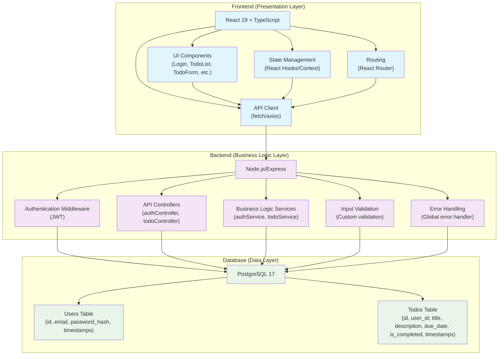

# 시스템 아키텍처 다이어그램

## 3-Tier Architecture

## 아키텍처 설명

### 프론트엔드 계층 (Frontend/Presentation Layer)
- **기술 스택**: React 19 + TypeScript
- **주요 구성 요소**:
  - UI 컴포넌트 (로그인, 할 일 목록, 폼 등)
  - 상태 관리 (React Hooks 및 Context API)
  - API 클라이언트 (fetch 또는 axios)
  - 라우팅 (React Router)
- **기능**: 사용자 인터페이스 렌더링 및 사용자 상호작용 처리

### 백엔드 계층 (Backend/Business Logic Layer)
- **기술 스택**: Node.js/Express
- **주요 구성 요소**:
  - 인증 미들웨어 (JWT 기반)
  - API 컨트롤러 (인증, 할 일 관리)
  - 비즈니스 로직 서비스
  - 입력 검증
  - 오류 처리
- **기능**: 비즈니스 로직 처리 및 API 엔드포인트 관리

### 데이터베이스 계층 (Database/Data Layer)
- **기술 스택**: PostgreSQL 17
- **주요 구성 요소**:
  - Users 테이블 (사용자 정보)
  - Todos 테이블 (할 일 정보)
- **기능**: 데이터 저장 및 검색

## 데이터 흐름
1. 프론트엔드에서 사용자 요청이 발생
2. API 클라이언트를 통해 백엔드로 요청 전송
3. 백엔드에서 인증 및 비즈니스 로직 처리
4. 데이터베이스에서 데이터 조회/저장
5. 결과를 프론트엔드로 반환하여 UI 업데이트

## 보안 고려사항
- JWT 기반 인증으로 사용자 세션 관리
- 모든 API 요청에 대한 인증/인가 검증
- 입력 검증을 통한 보안 취약점 방지
- 비밀번호는 bcrypt로 암호화 저장
- SQL Injection 방지를 위한 파라미터화된 쿼리 사용