# 기술 아키텍처 다이어그램
# Personal Todo Management System

**문서 버전:** 1.0
**작성일:** 2026-02-11
**프로젝트:** 개인 할 일 관리 시스템 MVP

---

## 1. 전체 시스템 아키텍처 (3-Tier Architecture)

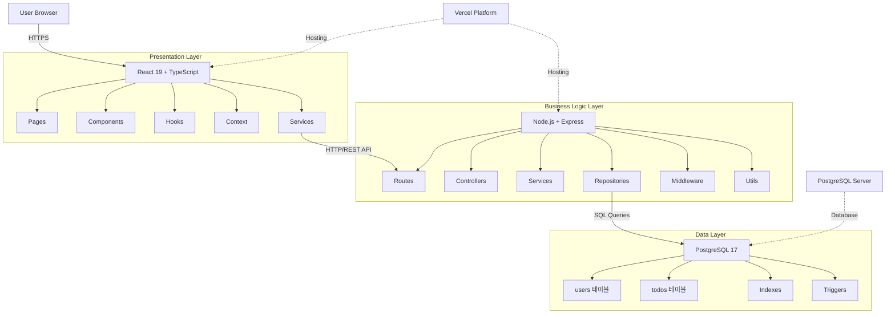

---

## 2. 백엔드 아키텍처 (Backend Architecture)

```mermaid
graph LR
    subgraph "API Gateway"
        R1[/api/auth/register]
        R2[/api/auth/login]
        R3[/api/todos]
        R4[/api/todos/:id]
    end

    subgraph "Middleware Layer"
        M1[authMiddleware]
        M2[errorHandler]
        M3[validator]
        M4[CORS]
    end

    subgraph "Controller Layer"
        C1[AuthController]
        C2[TodoController]
    end

    subgraph "Service Layer"
        S1[AuthService]
        S2[TodoService]
        S3[JWT Utils]
        S4[Password Utils]
    end

    subgraph "Repository Layer"
        P1[UserRepository]
        P2[TodoRepository]
    end

    subgraph "Database"
        D1[(users)]
        D2[(todos)]
    end

    R1 --> M4
    R2 --> M4
    R3 --> M1
    R4 --> M1

    M1 --> M3
    M3 --> C1
    M3 --> C2

    C1 --> S1
    C2 --> S2

    S1 --> S3
    S1 --> S4
    S1 --> P1

    S2 --> P2

    P1 --> D1
    P2 --> D2

    M2 -.->|Error Handling| C1
    M2 -.->|Error Handling| C2
```

---

## 3. 프론트엔드 아키텍처 (Frontend Architecture)

```mermaid
graph TB
    subgraph "Router"
        Route1[/login]
        Route2[/register]
        Route3[/todos]
    end

    subgraph "Pages"
        P1[LoginPage]
        P2[RegisterPage]
        P3[TodoListPage]
    end

    subgraph "Components"
        C1[LoginForm]
        C2[RegisterForm]
        C3[TodoList]
        C4[TodoItem]
        C5[TodoForm]
        C6[Header]
    end

    subgraph "Hooks"
        H1[useAuth]
        H2[useTodos]
        H3[useApi]
    end

    subgraph "Context"
        CTX[AuthContext]
    end

    subgraph "Services"
        S1[authService]
        S2[todoService]
        S3[apiClient]
    end

    Route1 --> P1
    Route2 --> P2
    Route3 --> P3

    P1 --> C1
    P2 --> C2
    P3 --> C3
    P3 --> C5
    P3 --> C6

    C3 --> C4

    C1 --> H1
    C2 --> H1
    C3 --> H2
    C4 --> H2
    C5 --> H2
    C6 --> H1

    H1 --> CTX
    H2 --> CTX
    H3 --> CTX

    H1 --> S1
    H2 --> S2

    S1 --> S3
    S2 --> S3

    S3 -->|HTTP Request| API[Backend API]
```

---

## 4. 데이터 플로우 다이어그램 (Data Flow)

### 4.1 사용자 인증 플로우

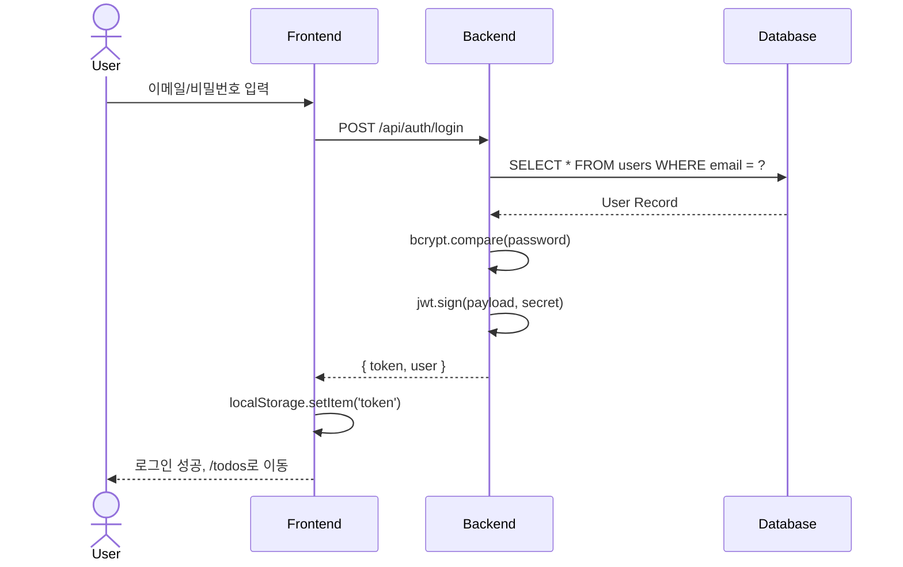

### 4.2 할 일 생성 플로우

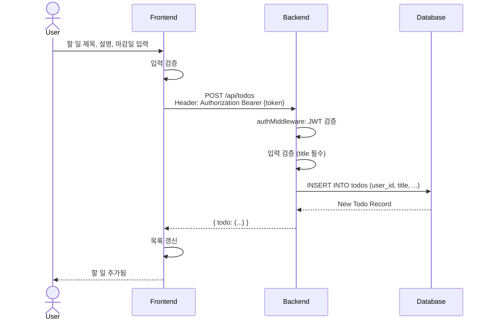

### 4.3 할 일 조회 및 분류 플로우

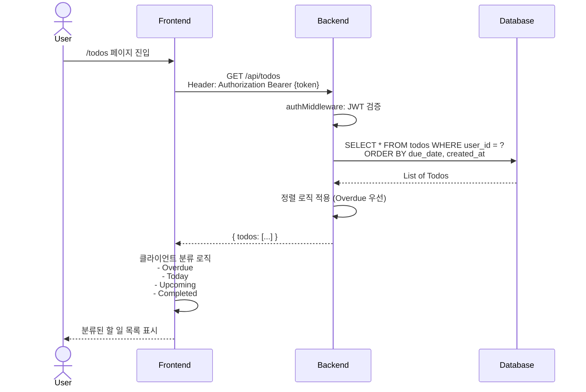

---

## 5. 데이터베이스 ERD (Entity Relationship Diagram)

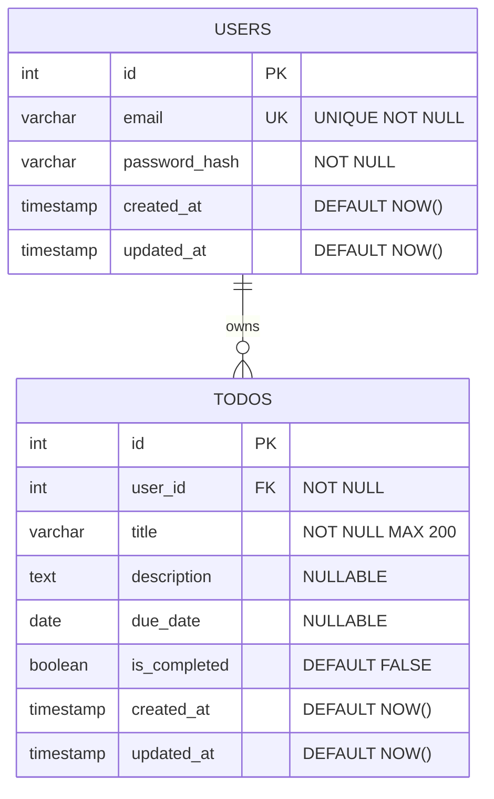

**인덱스:**
- `idx_users_email` ON users(email)
- `idx_todos_user_id` ON todos(user_id)
- `idx_todos_due_date` ON todos(due_date)
- `idx_todos_is_completed` ON todos(is_completed)
- `idx_todos_user_completed` ON todos(user_id, is_completed)

**트리거:**
- `update_users_updated_at`: users 테이블 UPDATE 시 updated_at 자동 갱신
- `update_todos_updated_at`: todos 테이블 UPDATE 시 updated_at 자동 갱신

**삭제 규칙:**
- User 삭제 시 해당 User의 모든 Todo는 CASCADE 삭제

---

## 6. 배포 아키텍처 (Deployment Architecture)

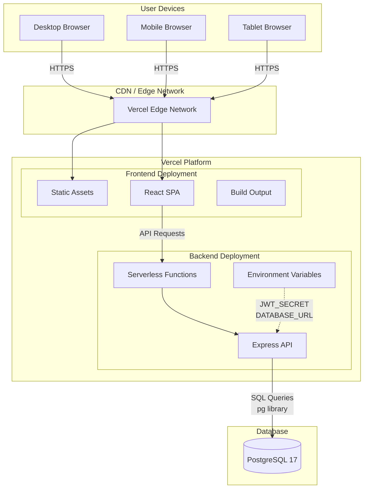

**배포 프로세스:**
1. 코드 푸시 → GitHub Repository
2. Vercel 자동 빌드 트리거
3. 프론트엔드 빌드 (React SPA)
4. 백엔드 빌드 (Express Serverless)
5. 배포 완료 → Edge Network 배포
6. HTTPS 자동 적용

---

## 7. 보안 아키텍처 (Security Architecture)

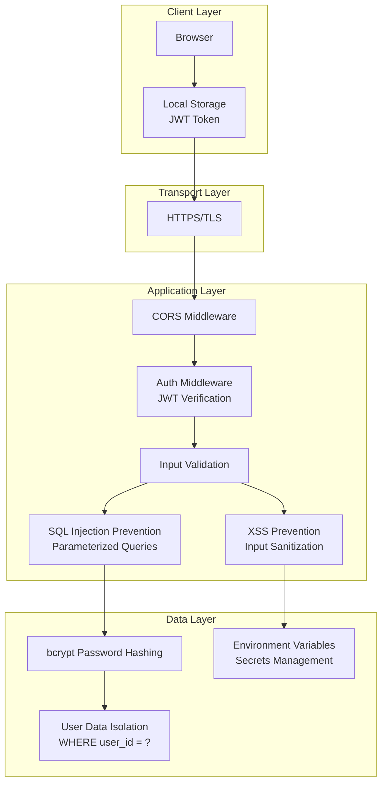

**보안 원칙:**
1. **인증:** JWT 기반, 최소 32자 Secret Key
2. **암호화:** bcrypt (최소 10 rounds)
3. **전송:** HTTPS 강제 (Vercel 자동 제공)
4. **입력 검증:** 클라이언트/서버 양쪽 검증
5. **SQL Injection 방어:** 파라미터화된 쿼리 (`pg` 라이브러리)
6. **XSS 방어:** 입력값 검증 및 이스케이프
7. **접근 제어:** 사용자별 데이터 완전 격리 (user_id 필터)

---

## 8. API 아키텍처 (API Architecture)

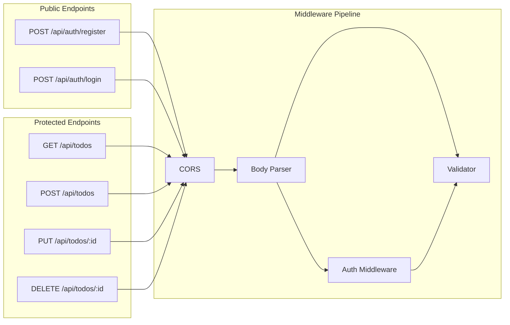

**API 명세:**

| Method | Endpoint | 인증 | 설명 |
|--------|----------|------|------|
| POST | /api/auth/register | ✗ | 회원가입 |
| POST | /api/auth/login | ✗ | 로그인 |
| GET | /api/todos | ✓ | 할 일 목록 조회 |
| POST | /api/todos | ✓ | 할 일 생성 |
| PUT | /api/todos/:id | ✓ | 할 일 수정 |
| DELETE | /api/todos/:id | ✓ | 할 일 삭제 |

**인증 헤더:**
```
Authorization: Bearer {jwt_token}
```

**응답 형식:**
```json
// 성공
{
  "todos": [...],
  "todo": {...},
  "token": "...",
  "user": {...}
}

// 실패
{
  "error": "Error message"
}
```

---

## 9. 상태 관리 아키텍처 (State Management)

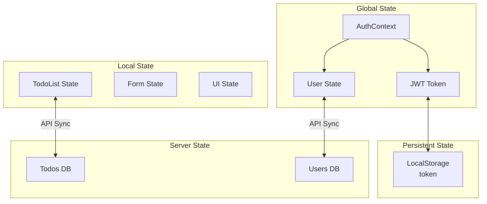

**상태 관리 전략:**
- **전역 상태:** React Context API (AuthContext)
- **로컬 상태:** useState, useReducer
- **서버 상태:** useTodos, useAuth 커스텀 훅
- **영속 상태:** localStorage (JWT 토큰)

---

## 10. 비즈니스 로직 레이어 (Business Logic Layer)

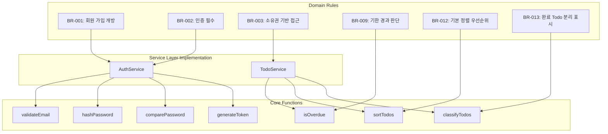

**핵심 비즈니스 로직:**

1. **isOverdue(todo):**
   - 마감일 < 오늘 AND is_completed = false → Overdue

2. **sortTodos(todos):**
   - 우선순위: Overdue > 마감일 빠른 순 > 마감일 없음 > 생성일 빠른 순

3. **classifyTodos(todos):**
   - Overdue: 마감일 < 오늘, 미완료
   - Today: 마감일 = 오늘, 미완료
   - Upcoming: 마감일 > 오늘, 미완료
   - Completed: 완료 상태

---

## 11. 기술 스택 요약 (Technology Stack Summary)

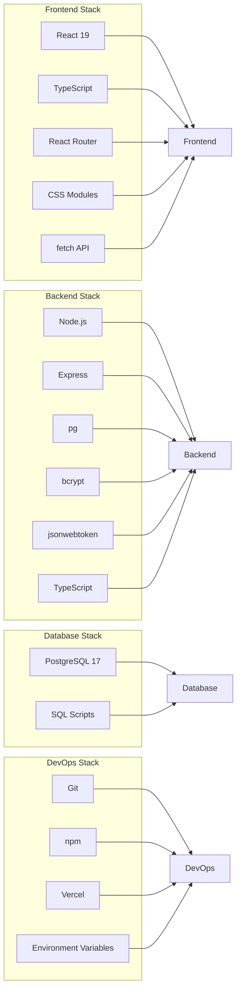

**주요 라이브러리:**
- **프론트엔드:** react, react-dom, react-router-dom, typescript
- **백엔드:** express, pg, bcrypt, jsonwebtoken, cors, dotenv
- **개발 도구:** typescript, @types/*, eslint, prettier

---

## 12. 성능 아키텍처 (Performance Architecture)

```mermaid
graph TB
    subgraph "Database Performance"
        DP1[Indexes on user_id, due_date, is_completed]
        DP2[Parameterized Queries]
        DP3[Connection Pooling]
    end

    subgraph "Backend Performance"
        BP1[Stateless API]
        BP2[Efficient Query Design]
        BP3[No N+1 Queries]
    end

    subgraph "Frontend Performance"
        FP1[Code Splitting]
        FP2[React.memo]
        FP3[useMemo / useCallback]
        FP4[Lazy Loading]
    end

    subgraph "Network Performance"
        NP1[HTTPS/2]
        NP2[CDN Edge Network]
        NP3[Gzip Compression]
    end

    DP1 & DP2 & DP3 --> DB_Perf[DB 최적화]
    BP1 & BP2 & BP3 --> BE_Perf[Backend 최적화]
    FP1 & FP2 & FP3 & FP4 --> FE_Perf[Frontend 최적화]
    NP1 & NP2 & NP3 --> Net_Perf[Network 최적화]
```

**성능 목표:**
- 할 일 목록 로딩: **2초 이내**
- 할 일 생성/수정/삭제: **1초 이내**
- 페이지 전환: **1초 이내**

---

## 13. 확장성 아키텍처 (Scalability Architecture)

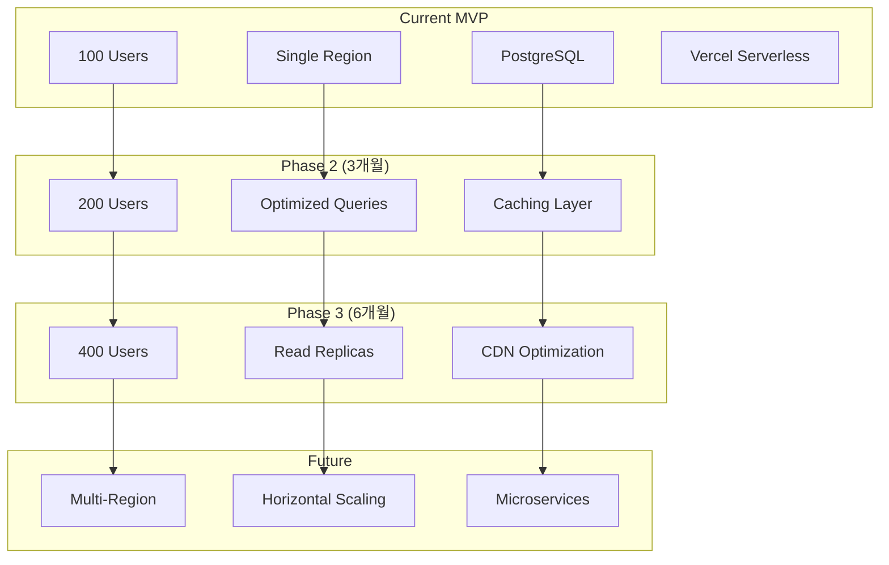

**확장 전략:**
1. **초기 (100명):** 현재 MVP 구조
2. **3개월 (200명):** 쿼리 최적화, 캐싱
3. **6개월 (400명):** Read Replica, CDN
4. **장기:** Multi-Region, Microservices

---

## 14. 모니터링 및 로깅 아키텍처 (Monitoring & Logging)

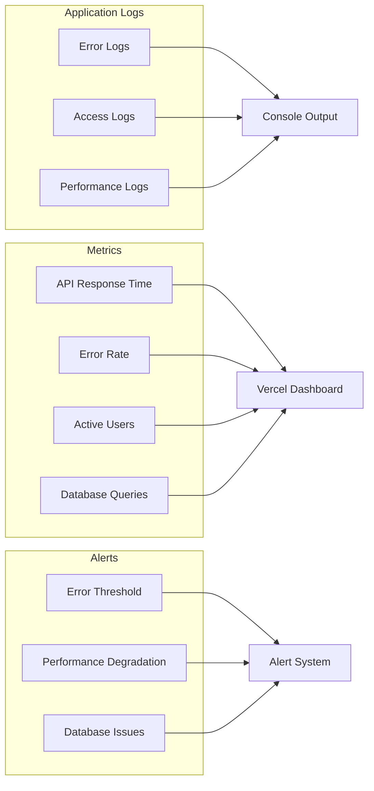

**로그 레벨:**
- `error`: 즉시 대응 필요
- `warn`: 주의 필요
- `info`: 비즈니스 이벤트
- `debug`: 개발 시에만

---

## 15. 참조 문서 (References)

- **도메인 정의서:** `docs/1-domain-definition.md`
- **PRD:** `docs/2-PRD.md`
- **사용자 시나리오:** `docs/3-user-scenario.md`
- **프로젝트 원칙:** `docs/4-project-principle.md`
- **ERD:** `docs/6-ERD.md`
- **실행 계획:** `docs/7-execution-plan.md`
- **API 명세:** `swagger/swagger.json`

---

**문서 종료**
