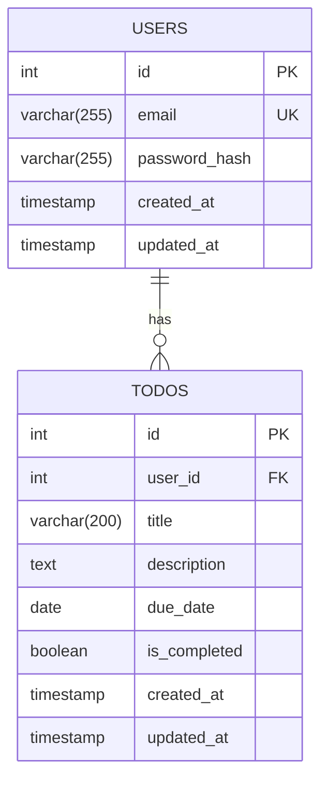

# 데이터베이스 ERD (Entity Relationship Diagram)

## Todo Management System

## 엔티티 설명

### USERS 테이블
- **id**: 사용자 고유 식별자 (SERIAL PRIMARY KEY)
- **email**: 사용자 이메일 (VARCHAR(255), UNIQUE NOT NULL)
- **password_hash**: bcrypt로 암호화된 비밀번호 (VARCHAR(255) NOT NULL)
- **created_at**: 계정 생성 시각 (TIMESTAMP, DEFAULT CURRENT_TIMESTAMP)
- **updated_at**: 계정 정보 수정 시각 (TIMESTAMP, DEFAULT CURRENT_TIMESTAMP)

### TODOS 테이블
- **id**: 할 일 고유 식별자 (SERIAL PRIMARY KEY)
- **user_id**: 소유자 사용자 ID (INTEGER NOT NULL, FOREIGN KEY REFERENCES users.id ON DELETE CASCADE)
- **title**: 할 일 제목 (VARCHAR(200) NOT NULL)
- **description**: 할 일 상세 설명 (TEXT, 선택)
- **due_date**: 마감일 (DATE, 선택)
- **is_completed**: 완료 여부 (BOOLEAN, DEFAULT FALSE)
- **created_at**: 생성 시각 (TIMESTAMP, DEFAULT CURRENT_TIMESTAMP)
- **updated_at**: 수정 시각 (TIMESTAMP, DEFAULT CURRENT_TIMESTAMP)

## 관계 설명
- USERS와 TODOS는 1:N 관계 (한 사용자는 여러 할 일을 가질 수 있음)
- 외래 키 제약 조건: todos.user_id는 users.id를 참조
- 삭제 규칙: 사용자 삭제 시 해당 사용자의 모든 할 일(CASCADE)이 함께 삭제됨

## 인덱스
- idx_users_email: users.email에 생성 (로그인 시 이메일 검색 최적화)
- idx_todos_user_id: todos.user_id에 생성 (사용자별 할 일 조회 최적화)
- idx_todos_due_date: todos.due_date에 생성 (마감일 기준 정렬 최적화)
- idx_todos_is_completed: todos.is_completed에 생성 (완료 상태 필터링 최적화)
- idx_todos_user_completed: todos.user_id, todos.is_completed에 생성 (복합 인덱스로 사용자별 완료 상태 조회 최적화)