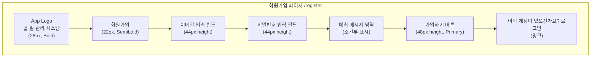
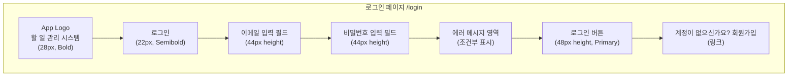
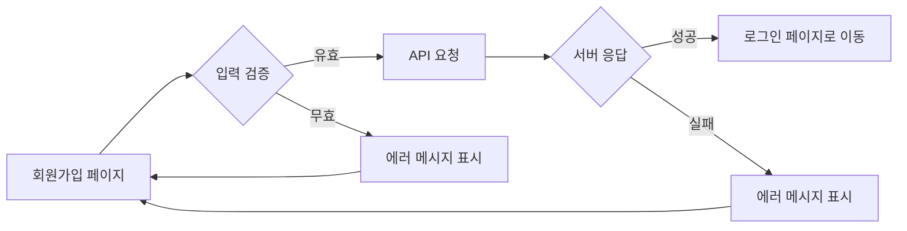
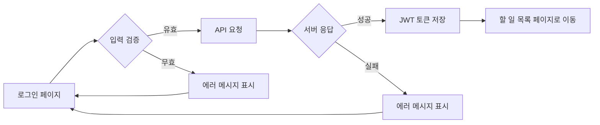
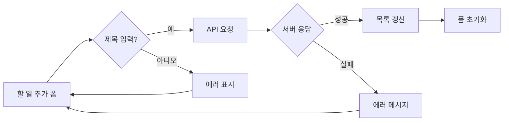
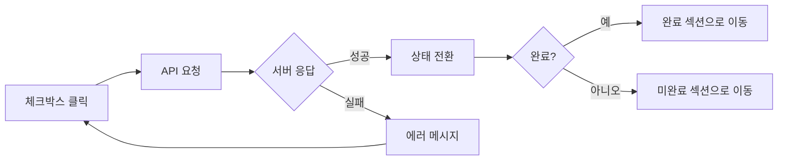
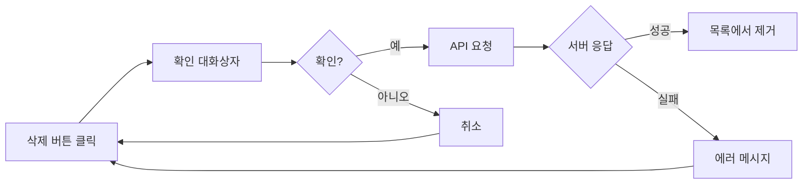

# 와이어프레임 (Wireframe)
# Personal Todo Management System MVP

**문서 버전:** 1.0
**작성일:** 2026-02-11
**프로젝트명:** 개인 할 일 관리 시스템
**디자인 도구:** Mermaid (텍스트 기반 다이어그램)

---

## 📋 목차

1. [와이어프레임 개요](#1-와이어프레임-개요)
2. [디자인 시스템](#2-디자인-시스템)
3. [회원가입 페이지](#3-회원가입-페이지)
4. [로그인 페이지](#4-로그인-페이지)
5. [할 일 목록 페이지 (메인)](#5-할-일-목록-페이지-메인)
6. [반응형 레이아웃](#6-반응형-레이아웃)
7. [인터랙션 플로우](#7-인터랙션-플로우)
8. [컴포넌트 상세 명세](#8-컴포넌트-상세-명세)

---

## 1. 와이어프레임 개요

### 1.1 페이지 구성
본 MVP는 총 **3개의 페이지**로 구성됩니다:

1. **회원가입 페이지** (`/register`)
2. **로그인 페이지** (`/login`)
3. **할 일 목록 페이지** (`/todos`) - 메인 페이지

### 1.2 디자인 원칙
- ✅ **단순함 (Simplicity)**: 불필요한 요소 제거, 핵심 기능에 집중
- ✅ **직관성 (Intuitiveness)**: 별도 교육 없이 사용 가능
- ✅ **일관성 (Consistency)**: 모든 페이지에서 동일한 디자인 패턴
- ✅ **접근성 (Accessibility)**: 명확한 레이블, 충분한 터치 타겟 크기
- ✅ **반응형 (Responsive)**: 모바일부터 데스크탑까지 최적화

### 1.3 타겟 디바이스
- **모바일:** 320px ~ 767px (Primary)
- **태블릿:** 768px ~ 1023px
- **데스크탑:** 1024px 이상

---

## 2. 디자인 시스템

### 2.1 색상 팔레트

```css
/* Primary Colors */
--primary-blue: #007AFF;        /* 버튼, 링크, 강조 */
--success-green: #34C759;       /* 완료 상태 */
--warning-orange: #FF9500;      /* 오늘 할 일 */
--danger-red: #FF3B30;          /* 기한 경과, 삭제 */

/* Grayscale */
--gray-900: #000000;            /* 주요 텍스트 */
--gray-600: #8E8E93;            /* 보조 텍스트, 완료된 항목 */
--gray-200: #E5E5EA;            /* 테두리 */
--gray-100: #F2F2F7;            /* 배경 */
--white: #FFFFFF;               /* 카드 배경 */
```

### 2.2 타이포그래피

```css
/* Font Family */
--font-family: -apple-system, BlinkMacSystemFont, 'Segoe UI', 'Roboto',
               'Helvetica Neue', Arial, sans-serif;

/* Font Sizes */
--font-size-h1: 28px;           /* 페이지 제목 */
--font-size-h2: 22px;           /* 섹션 제목 */
--font-size-h3: 18px;           /* 카드 제목 */
--font-size-body: 16px;         /* 본문 텍스트 */
--font-size-small: 14px;        /* 보조 텍스트 */
--font-size-caption: 12px;      /* 캡션, 날짜 */

/* Font Weights */
--font-weight-bold: 700;
--font-weight-semibold: 600;
--font-weight-regular: 400;
```

### 2.3 간격 (Spacing)

```css
--spacing-xs: 4px;
--spacing-sm: 8px;
--spacing-md: 16px;
--spacing-lg: 24px;
--spacing-xl: 32px;
```

### 2.4 테두리 반경 (Border Radius)

```css
--radius-sm: 4px;               /* 버튼, 입력 필드 */
--radius-md: 8px;               /* 카드 */
--radius-lg: 12px;              /* 모달 */
```

### 2.5 그림자 (Shadow)

```css
--shadow-sm: 0 1px 2px rgba(0, 0, 0, 0.05);
--shadow-md: 0 4px 6px rgba(0, 0, 0, 0.1);
--shadow-lg: 0 10px 15px rgba(0, 0, 0, 0.1);
```

---

## 3. 회원가입 페이지

### 3.1 레이아웃 구조

```
┌─────────────────────────────────────────┐
│                                         │
│              [App Logo]                 │
│                                         │
│           할 일 관리 시스템              │
│                                         │
├─────────────────────────────────────────┤
│                                         │
│         ┌───────────────────┐          │
│         │   회원가입        │          │
│         └───────────────────┘          │
│                                         │
│         ┌───────────────────┐          │
│  이메일 │                   │          │
│         └───────────────────┘          │
│                                         │
│         ┌───────────────────┐          │
│비밀번호 │       ••••••       │          │
│         └───────────────────┘          │
│                                         │
│         [ 에러 메시지 영역 ]            │
│                                         │
│         ┌───────────────────┐          │
│         │   가입하기        │          │
│         └───────────────────┘          │
│                                         │
│    이미 계정이 있으신가요? 로그인       │
│                                         │
└─────────────────────────────────────────┘
```

### 3.2 상세 명세

**페이지 제목:**
- 텍스트: "할 일 관리 시스템"
- 폰트 크기: 28px (H1)
- 폰트 굵기: Bold (700)
- 색상: Gray-900
- 정렬: 중앙

**섹션 제목:**
- 텍스트: "회원가입"
- 폰트 크기: 22px (H2)
- 폰트 굵기: Semibold (600)
- 색상: Gray-900
- 여백: 상단 32px, 하단 24px

**이메일 입력 필드:**
- 레이블: "이메일" (14px, Gray-600)
- 타입: `email`
- Placeholder: "example@email.com"
- 높이: 44px
- 테두리: 1px solid Gray-200
- 테두리 반경: 4px
- 패딩: 12px 16px
- Focus 시: 테두리 Primary-Blue

**비밀번호 입력 필드:**
- 레이블: "비밀번호" (14px, Gray-600)
- 타입: `password`
- Placeholder: "최소 8자 이상"
- 높이: 44px
- 테두리: 1px solid Gray-200
- 테두리 반경: 4px
- 패딩: 12px 16px
- Focus 시: 테두리 Primary-Blue

**에러 메시지 영역:**
- 폰트 크기: 14px
- 색상: Danger-Red
- 배경: rgba(255, 59, 48, 0.1)
- 패딩: 12px 16px
- 테두리 반경: 4px
- 예시: "이미 사용 중인 이메일입니다"

**가입하기 버튼:**
- 텍스트: "가입하기"
- 배경색: Primary-Blue
- 텍스트 색상: White
- 높이: 48px
- 테두리 반경: 4px
- 폰트 크기: 16px
- 폰트 굵기: Semibold (600)
- Hover 시: 배경색 어둡게 (#0051D5)
- Disabled 시: 배경색 Gray-200, 텍스트 Gray-600

**로그인 링크:**
- 텍스트: "이미 계정이 있으신가요? 로그인"
- 폰트 크기: 14px
- 색상: Gray-600, "로그인"은 Primary-Blue
- 정렬: 중앙
- 여백: 상단 24px

### 3.3 Mermaid 다이어그램



### 3.4 입력 검증 규칙

**이메일:**
- ✅ 필수 입력
- ✅ 유효한 이메일 형식 (`/^[^\s@]+@[^\s@]+\.[^\s@]+$/`)
- ❌ "유효한 이메일 주소를 입력하세요"

**비밀번호:**
- ✅ 필수 입력
- ✅ 최소 8자 이상
- ❌ "비밀번호는 최소 8자 이상이어야 합니다"

---

## 4. 로그인 페이지

### 4.1 레이아웃 구조

```
┌─────────────────────────────────────────┐
│                                         │
│              [App Logo]                 │
│                                         │
│           할 일 관리 시스템              │
│                                         │
├─────────────────────────────────────────┤
│                                         │
│         ┌───────────────────┐          │
│         │     로그인        │          │
│         └───────────────────┘          │
│                                         │
│         ┌───────────────────┐          │
│  이메일 │                   │          │
│         └───────────────────┘          │
│                                         │
│         ┌───────────────────┐          │
│비밀번호 │       ••••••       │          │
│         └───────────────────┘          │
│                                         │
│         [ 에러 메시지 영역 ]            │
│                                         │
│         ┌───────────────────┐          │
│         │    로그인         │          │
│         └───────────────────┘          │
│                                         │
│    계정이 없으신가요? 회원가입          │
│                                         │
└─────────────────────────────────────────┘
```

### 4.2 상세 명세

**로그인 페이지는 회원가입 페이지와 거의 동일한 구조**

**차이점:**
- 섹션 제목: "로그인"
- 버튼 텍스트: "로그인"
- 하단 링크: "계정이 없으신가요? 회원가입"
- 에러 메시지: "이메일 또는 비밀번호가 올바르지 않습니다"

### 4.3 Mermaid 다이어그램



---

## 5. 할 일 목록 페이지 (메인)

### 5.1 전체 레이아웃 구조

```
┌─────────────────────────────────────────────────────────┐
│ ┌─────────────────────────────────────────────────────┐ │
│ │  할 일 관리        user@email.com    [ 로그아웃 ]   │ │ ← Header
│ └─────────────────────────────────────────────────────┘ │
│                                                           │
│ ┌─────────────────────────────────────────────────────┐ │
│ │         새로운 할 일 추가                           │ │
│ │  ┌───────────────────────────────────────────────┐ │ │
│ │  │ 제목을 입력하세요                             │ │ │
│ │  └───────────────────────────────────────────────┘ │ │
│ │  ┌───────────────────────────────────────────────┐ │ │
│ │  │ 설명을 입력하세요 (선택)                      │ │ │ ← Todo Form
│ │  └───────────────────────────────────────────────┘ │ │
│ │  마감일: [  📅 2026-02-15  ]    [ 추가 ]          │ │
│ └─────────────────────────────────────────────────────┘ │
│                                                           │
│ ┌─────────────────────────────────────────────────────┐ │
│ │  🔴 기한 경과 (2)                                   │ │
│ │  ┌───────────────────────────────────────────────┐ │ │
│ │  │ ☐ 프로젝트 기획서 작성    📅 2026-02-10  🗑 ✏  │ │ │
│ │  │    PRD 문서 작성 및 검토                      │ │ │ ← Overdue
│ │  └───────────────────────────────────────────────┘ │ │   Section
│ │  ┌───────────────────────────────────────────────┐ │ │
│ │  │ ☐ 회의 준비                   📅 2026-02-09  🗑 ✏  │ │ │
│ │  └───────────────────────────────────────────────┘ │ │
│ └─────────────────────────────────────────────────────┘ │
│                                                           │
│ ┌─────────────────────────────────────────────────────┐ │
│ │  🟠 오늘 (1)                                        │ │
│ │  ┌───────────────────────────────────────────────┐ │ │
│ │  │ ☐ 데이터베이스 설계          📅 2026-02-11  🗑 ✏  │ │ │ ← Today
│ │  └───────────────────────────────────────────────┘ │ │   Section
│ └─────────────────────────────────────────────────────┘ │
│                                                           │
│ ┌─────────────────────────────────────────────────────┐ │
│ │  📌 예정 (2)                                        │ │
│ │  ┌───────────────────────────────────────────────┐ │ │
│ │  │ ☐ 코드 리뷰                   📅 2026-02-15  🗑 ✏  │ │ │ ← Upcoming
│ │  └───────────────────────────────────────────────┘ │ │   Section
│ └─────────────────────────────────────────────────────┘ │
│                                                           │
│ ┌─────────────────────────────────────────────────────┐ │
│ │  ✅ 완료 (3)                              [접기 ▼]  │ │
│ │  ┌───────────────────────────────────────────────┐ │ │
│ │  │ ☑ 테스트 작성                 📅 2026-02-10  🗑 ✏  │ │ │ ← Completed
│ │  │    단위 테스트 작성 완료                      │ │ │   Section
│ │  └───────────────────────────────────────────────┘ │ │
│ └─────────────────────────────────────────────────────┘ │
└─────────────────────────────────────────────────────────┘
```

### 5.2 Header 영역

```
┌─────────────────────────────────────────────────────────┐
│  할 일 관리        user@email.com    [ 로그아웃 ]       │
└─────────────────────────────────────────────────────────┘
```

**구성 요소:**

1. **앱 제목 (좌측)**
   - 텍스트: "할 일 관리"
   - 폰트 크기: 20px
   - 폰트 굵기: Bold (700)
   - 색상: Gray-900

2. **사용자 이메일 (중앙)**
   - 텍스트: 현재 로그인한 사용자 이메일
   - 폰트 크기: 14px
   - 색상: Gray-600

3. **로그아웃 버튼 (우측)**
   - 텍스트: "로그아웃"
   - 배경색: 투명
   - 텍스트 색상: Primary-Blue
   - 패딩: 8px 16px
   - 테두리: 1px solid Primary-Blue
   - 테두리 반경: 4px
   - Hover 시: 배경색 rgba(0, 122, 255, 0.1)

**스타일:**
- 배경색: White
- 높이: 60px
- 하단 그림자: Shadow-sm
- 패딩: 0 16px (모바일), 0 24px (데스크탑)
- 고정 위치: 스크롤 시에도 상단 고정 (position: sticky)

### 5.3 할 일 추가 폼 (Todo Form)

```
┌─────────────────────────────────────────────────────────┐
│         새로운 할 일 추가                               │
│  ┌───────────────────────────────────────────────────┐ │
│  │ 제목을 입력하세요                                 │ │
│  └───────────────────────────────────────────────────┘ │
│  ┌───────────────────────────────────────────────────┐ │
│  │ 설명을 입력하세요 (선택)                          │ │
│  │                                                   │ │
│  └───────────────────────────────────────────────────┘ │
│  마감일: [  📅 2026-02-15  ]    [ 추가 ]              │
└─────────────────────────────────────────────────────────┘
```

**구성 요소:**

1. **섹션 제목**
   - 텍스트: "새로운 할 일 추가"
   - 폰트 크기: 18px
   - 폰트 굵기: Semibold (600)
   - 색상: Gray-900
   - 여백: 하단 16px

2. **제목 입력 필드**
   - Placeholder: "제목을 입력하세요"
   - 타입: `text`
   - 높이: 44px
   - 최대 길이: 200자
   - 테두리: 1px solid Gray-200
   - 테두리 반경: 4px
   - 패딩: 12px 16px

3. **설명 입력 필드 (Textarea)**
   - Placeholder: "설명을 입력하세요 (선택)"
   - 타입: `textarea`
   - 높이: 80px (확장 가능)
   - 최대 길이: 1000자
   - 테두리: 1px solid Gray-200
   - 테두리 반경: 4px
   - 패딩: 12px 16px

4. **마감일 선택기 (Date Picker)**
   - 레이블: "마감일:"
   - 타입: `date`
   - 너비: 150px
   - 높이: 44px
   - 아이콘: 📅 (달력)
   - 테두리: 1px solid Gray-200
   - 테두리 반경: 4px

5. **추가 버튼**
   - 텍스트: "추가"
   - 배경색: Primary-Blue
   - 텍스트 색상: White
   - 높이: 44px
   - 너비: 80px (모바일), 100px (데스크탑)
   - 테두리 반경: 4px
   - Hover 시: 배경색 어둡게

**스타일:**
- 배경색: White
- 패딩: 24px
- 테두리 반경: 8px
- 그림자: Shadow-md
- 여백: 하단 24px

### 5.4 할 일 카드 (Todo Item Card)

```
┌─────────────────────────────────────────────────────────┐
│ ☐ 프로젝트 기획서 작성    📅 2026-02-15    🗑 ✏️        │
│    PRD 문서 작성 및 검토                                │
└─────────────────────────────────────────────────────────┘
```

**구성 요소:**

1. **체크박스 (좌측)**
   - 크기: 20x20px
   - 미완료: ☐ (빈 체크박스)
   - 완료: ☑ (채워진 체크박스)
   - 테두리: 2px solid Gray-200
   - 완료 시: 배경색 Success-Green

2. **제목 (메인)**
   - 폰트 크기: 16px
   - 폰트 굵기: Semibold (600)
   - 색상: Gray-900
   - 완료 시: 취소선 (text-decoration: line-through), 색상 Gray-600

3. **마감일 (우측)**
   - 아이콘: 📅
   - 폰트 크기: 14px
   - 색상: Gray-600
   - 기한 경과 시: 색상 Danger-Red, 굵게

4. **액션 버튼 (우측)**
   - **수정 버튼:** ✏️ (연필 아이콘)
   - **삭제 버튼:** 🗑 (휴지통 아이콘)
   - 크기: 32x32px
   - 배경: 투명
   - Hover 시: 배경색 Gray-100

5. **설명 (하단, 선택)**
   - 폰트 크기: 14px
   - 색상: Gray-600
   - 여백: 상단 8px
   - 완료 시: 색상 더 흐리게

**상태별 스타일:**

**미완료 (Incomplete):**
- 배경색: White
- 테두리: 1px solid Gray-200

**완료 (Completed):**
- 배경색: Gray-100
- 제목: 취소선, Gray-600
- 체크박스: Success-Green 배경

**기한 경과 (Overdue):**
- 배경색: rgba(255, 59, 48, 0.05)
- 테두리: 2px solid Danger-Red
- 마감일: Danger-Red, Bold

**오늘 (Today):**
- 배경색: rgba(255, 149, 0, 0.05)
- 테두리: 2px solid Warning-Orange

**카드 공통 스타일:**
- 패딩: 16px
- 테두리 반경: 8px
- 그림자: Shadow-sm
- 여백: 하단 12px
- Hover 시: 그림자 Shadow-md, 커서 pointer

### 5.5 섹션별 구조

#### 🔴 기한 경과 섹션 (Overdue Section)

```
┌─────────────────────────────────────────────────────────┐
│  🔴 기한 경과 (2)                                       │
│  ┌───────────────────────────────────────────────────┐ │
│  │ [Todo Item Card - Overdue Style]                  │ │
│  └───────────────────────────────────────────────────┘ │
│  ┌───────────────────────────────────────────────────┐ │
│  │ [Todo Item Card - Overdue Style]                  │ │
│  └───────────────────────────────────────────────────┘ │
└─────────────────────────────────────────────────────────┘
```

**섹션 헤더:**
- 아이콘: 🔴 (빨간 원)
- 텍스트: "기한 경과 ({count})"
- 폰트 크기: 18px
- 폰트 굵기: Semibold (600)
- 색상: Danger-Red
- 여백: 상단 24px, 하단 16px

**표시 조건:**
- 마감일 < 오늘 AND 미완료 상태
- 할 일 없으면 섹션 숨김

#### 🟠 오늘 섹션 (Today Section)

**섹션 헤더:**
- 아이콘: 🟠 (주황 원)
- 텍스트: "오늘 ({count})"
- 색상: Warning-Orange

**표시 조건:**
- 마감일 = 오늘 AND 미완료 상태

#### 📌 예정 섹션 (Upcoming Section)

**섹션 헤더:**
- 아이콘: 📌 (핀)
- 텍스트: "예정 ({count})"
- 색상: Primary-Blue

**표시 조건:**
- 마감일 > 오늘 AND 미완료 상태
- 마감일 빠른 순으로 정렬

#### ✅ 완료 섹션 (Completed Section)

```
┌─────────────────────────────────────────────────────────┐
│  ✅ 완료 (3)                              [접기 ▼]      │
│  ┌───────────────────────────────────────────────────┐ │
│  │ [Todo Item Card - Completed Style]                │ │
│  └───────────────────────────────────────────────────┘ │
└─────────────────────────────────────────────────────────┘
```

**섹션 헤더:**
- 아이콘: ✅ (체크 마크)
- 텍스트: "완료 ({count})"
- 색상: Success-Green
- 토글 버튼: "접기 ▼" / "펼치기 ▶"

**표시 조건:**
- is_completed = true
- 기본적으로 접힌 상태 (선택)

**토글 버튼:**
- 클릭 시 완료된 할 일 목록 표시/숨김
- 아이콘: ▼ (펼침), ▶ (접힘)

### 5.6 빈 상태 (Empty State)

```
┌─────────────────────────────────────────────────────────┐
│                                                           │
│                     📝                                    │
│                                                           │
│              할 일이 없습니다                             │
│                                                           │
│      위의 폼에서 새로운 할 일을 추가해보세요              │
│                                                           │
└─────────────────────────────────────────────────────────┘
```

**구성 요소:**
- 아이콘: 📝 (크기 64px)
- 제목: "할 일이 없습니다" (18px, Semibold, Gray-600)
- 설명: "위의 폼에서 새로운 할 일을 추가해보세요" (14px, Gray-600)
- 정렬: 중앙
- 패딩: 48px

**표시 조건:**
- 해당 섹션에 할 일이 0개일 때

### 5.7 Mermaid 다이어그램 (메인 페이지)

```mermaid
graph TB
    subgraph TodoListPage["할 일 목록 페이지 /todos"]
        Header["Header<br/>앱 제목 | 사용자 이메일 | 로그아웃"]
        TodoForm["할 일 추가 폼<br/>제목 | 설명 | 마감일 | 추가 버튼"]

        subgraph Sections["할 일 섹션"]
            Overdue["🔴 기한 경과 섹션<br/>(마감일 < 오늘, 미완료)"]
            Today["🟠 오늘 섹션<br/>(마감일 = 오늘, 미완료)"]
            Upcoming["📌 예정 섹션<br/>(마감일 > 오늘, 미완료)"]
            NoDeadline["📋 마감일 없음 섹션<br/>(마감일 없음, 미완료)"]
            Completed["✅ 완료 섹션<br/>(완료 상태, 토글 가능)"]
        end

        subgraph TodoCard["할 일 카드"]
            Checkbox["체크박스"]
            Title["제목"]
            Description["설명 (선택)"]
            DueDate["마감일"]
            Actions["액션 (수정, 삭제)"]
        end
    end

    Header --> TodoForm
    TodoForm --> Overdue
    Overdue --> Today
    Today --> Upcoming
    Upcoming --> NoDeadline
    NoDeadline --> Completed

    Completed -.포함.-> TodoCard
```



---

## 6. 반응형 레이아웃

### 6.1 모바일 (320px ~ 767px)

**레이아웃 특징:**
- ✅ 단일 컬럼 레이아웃
- ✅ 헤더를 제외한 모든 요소 세로 배치
- ✅ 카드 너비: 100% (좌우 여백 16px)
- ✅ 터치 타겟 최소 44x44px
- ✅ 폰트 크기 약간 축소 (가독성 유지)

**모바일 전용 조정:**

**Header:**
- 높이: 56px
- 제목 폰트 크기: 18px
- 이메일 숨김 (공간 절약)
- 로그아웃 버튼: 아이콘만 표시 (🚪)

**Todo Form:**
- 마감일과 추가 버튼을 세로로 배치
- 추가 버튼 너비: 100%

**Todo Card:**
- 액션 버튼을 카드 하단에 배치 (스와이프 제스처 고려)
- 제목과 마감일을 두 줄로 배치

**모바일 레이아웃 예시:**

```
┌───────────────────────┐
│ 할 일 관리     [🚪]  │
├───────────────────────┤
│  새로운 할 일 추가    │
│  ┌─────────────────┐ │
│  │ 제목            │ │
│  └─────────────────┘ │
│  ┌─────────────────┐ │
│  │ 설명            │ │
│  └─────────────────┘ │
│  ┌─────────────────┐ │
│  │ 📅 2026-02-15   │ │
│  └─────────────────┘ │
│  ┌─────────────────┐ │
│  │     추가        │ │
│  └─────────────────┘ │
├───────────────────────┤
│ 🔴 기한 경과 (2)     │
│ ┌─────────────────┐  │
│ │ ☐ 할 일 제목    │  │
│ │ 📅 2026-02-10   │  │
│ │   설명...       │  │
│ │     ✏️  🗑      │  │
│ └─────────────────┘  │
└───────────────────────┘
```

### 6.2 태블릿 (768px ~ 1023px)

**레이아웃 특징:**
- ✅ 단일 컬럼 유지 (모바일과 유사)
- ✅ 카드 너비: 최대 720px (중앙 정렬)
- ✅ 좌우 여백: 24px
- ✅ 폰트 크기 표준 유지

**태블릿 전용 조정:**

**Header:**
- 높이: 60px
- 사용자 이메일 표시

**Todo Form:**
- 마감일과 추가 버튼을 가로로 배치
- 추가 버튼 너비: 자동 (100px)

### 6.3 데스크탑 (1024px 이상)

**레이아웃 특징:**
- ✅ 최대 너비: 960px (중앙 정렬)
- ✅ 좌우 여백: 자동
- ✅ 카드 Hover 효과 강화

**데스크탑 전용 조정:**

**Todo Form:**
- Flexbox 레이아웃: 제목, 설명, 마감일, 버튼을 가로로 배치 (선택)
- 또는 2컬럼 그리드 레이아웃

**Todo Card:**
- Hover 시 그림자 강화 (Shadow-lg)
- 마우스 커서: pointer

### 6.4 반응형 브레이크포인트

```css
/* Mobile First */
/* Base styles: 320px ~ 767px */

/* Tablet */
@media (min-width: 768px) {
    .container {
        max-width: 720px;
        margin: 0 auto;
        padding: 0 24px;
    }

    .header {
        height: 60px;
    }

    .user-email {
        display: block; /* 태블릿부터 이메일 표시 */
    }
}

/* Desktop */
@media (min-width: 1024px) {
    .container {
        max-width: 960px;
    }

    .todo-card:hover {
        box-shadow: var(--shadow-lg);
    }
}

/* Large Desktop */
@media (min-width: 1440px) {
    .container {
        max-width: 1200px;
    }
}
```

---

## 7. 인터랙션 플로우

### 7.1 회원가입 플로우



### 7.2 로그인 플로우



### 7.3 할 일 생성 플로우



### 7.4 할 일 완료 처리 플로우



### 7.5 할 일 삭제 플로우



---

## 8. 컴포넌트 상세 명세

### 8.1 버튼 컴포넌트 (Button)

**Variants:**

1. **Primary Button**
   - 배경색: Primary-Blue
   - 텍스트 색상: White
   - 용도: 주요 액션 (로그인, 가입, 추가)

2. **Secondary Button**
   - 배경색: 투명
   - 텍스트 색상: Primary-Blue
   - 테두리: 1px solid Primary-Blue
   - 용도: 보조 액션 (취소, 로그아웃)

3. **Danger Button**
   - 배경색: Danger-Red
   - 텍스트 색상: White
   - 용도: 삭제 확인

**States:**
- **Default:** 기본 스타일
- **Hover:** 배경색 10% 어둡게
- **Active:** 배경색 20% 어둡게, 약간 눌림 효과
- **Disabled:** 배경색 Gray-200, 텍스트 Gray-600, 커서 not-allowed

**CSS:**
```css
.button {
    height: 44px;
    padding: 0 24px;
    border-radius: 4px;
    font-size: 16px;
    font-weight: 600;
    cursor: pointer;
    transition: all 0.2s ease;
}

.button-primary {
    background-color: var(--primary-blue);
    color: var(--white);
    border: none;
}

.button-primary:hover {
    background-color: #0051D5;
}

.button-secondary {
    background-color: transparent;
    color: var(--primary-blue);
    border: 1px solid var(--primary-blue);
}

.button-danger {
    background-color: var(--danger-red);
    color: var(--white);
    border: none;
}

.button:disabled {
    background-color: var(--gray-200);
    color: var(--gray-600);
    cursor: not-allowed;
}
```

### 8.2 입력 필드 컴포넌트 (Input)

**Props:**
- `type`: text, email, password, date
- `placeholder`: 안내 텍스트
- `value`: 현재 값
- `onChange`: 변경 이벤트 핸들러
- `error`: 에러 메시지 (있으면 빨간 테두리)
- `label`: 레이블 텍스트

**States:**
- **Default:** 기본 스타일
- **Focus:** 테두리 Primary-Blue, 그림자 추가
- **Error:** 테두리 Danger-Red
- **Disabled:** 배경색 Gray-100, 커서 not-allowed

**CSS:**
```css
.input-group {
    margin-bottom: 16px;
}

.input-label {
    display: block;
    font-size: 14px;
    color: var(--gray-600);
    margin-bottom: 8px;
}

.input-field {
    width: 100%;
    height: 44px;
    padding: 12px 16px;
    border: 1px solid var(--gray-200);
    border-radius: 4px;
    font-size: 16px;
    transition: all 0.2s ease;
}

.input-field:focus {
    outline: none;
    border-color: var(--primary-blue);
    box-shadow: 0 0 0 3px rgba(0, 122, 255, 0.1);
}

.input-field.error {
    border-color: var(--danger-red);
}

.input-error-message {
    font-size: 14px;
    color: var(--danger-red);
    margin-top: 4px;
}
```

### 8.3 체크박스 컴포넌트 (Checkbox)

**Props:**
- `checked`: 체크 상태
- `onChange`: 변경 이벤트 핸들러

**States:**
- **Unchecked:** 빈 체크박스
- **Checked:** 채워진 체크박스 (Success-Green)

**CSS:**
```css
.checkbox {
    width: 20px;
    height: 20px;
    border: 2px solid var(--gray-200);
    border-radius: 4px;
    cursor: pointer;
    transition: all 0.2s ease;
}

.checkbox:checked {
    background-color: var(--success-green);
    border-color: var(--success-green);
}
```

### 8.4 모달 컴포넌트 (Modal)

**Props:**
- `isOpen`: 모달 열림 여부
- `onClose`: 닫기 이벤트 핸들러
- `title`: 모달 제목
- `children`: 모달 콘텐츠

**구조:**
```
┌─────────────────────────────────────┐
│  [X]  모달 제목                     │
├─────────────────────────────────────┤
│                                     │
│  모달 콘텐츠 영역                   │
│                                     │
├─────────────────────────────────────┤
│         [취소]    [확인]            │
└─────────────────────────────────────┘
```

**CSS:**
```css
.modal-overlay {
    position: fixed;
    top: 0;
    left: 0;
    right: 0;
    bottom: 0;
    background-color: rgba(0, 0, 0, 0.5);
    display: flex;
    align-items: center;
    justify-content: center;
    z-index: 1000;
}

.modal-content {
    background-color: var(--white);
    border-radius: 12px;
    max-width: 500px;
    width: 90%;
    box-shadow: var(--shadow-lg);
}

.modal-header {
    padding: 20px;
    border-bottom: 1px solid var(--gray-200);
}

.modal-body {
    padding: 20px;
}

.modal-footer {
    padding: 20px;
    border-top: 1px solid var(--gray-200);
    display: flex;
    justify-content: flex-end;
    gap: 12px;
}
```

---

## 9. 애니메이션 및 트랜지션

### 9.1 페이지 전환 애니메이션

**Fade In:**
```css
@keyframes fadeIn {
    from {
        opacity: 0;
    }
    to {
        opacity: 1;
    }
}

.page-enter {
    animation: fadeIn 0.3s ease-in-out;
}
```

### 9.2 할 일 카드 애니메이션

**등장 애니메이션:**
```css
@keyframes slideIn {
    from {
        transform: translateY(-10px);
        opacity: 0;
    }
    to {
        transform: translateY(0);
        opacity: 1;
    }
}

.todo-card-enter {
    animation: slideIn 0.2s ease-out;
}
```

**삭제 애니메이션:**
```css
@keyframes slideOut {
    to {
        transform: translateX(100%);
        opacity: 0;
    }
}

.todo-card-exit {
    animation: slideOut 0.2s ease-in;
}
```

### 9.3 버튼 Hover 효과

```css
.button {
    transition: all 0.2s ease;
}

.button:hover {
    transform: translateY(-2px);
    box-shadow: var(--shadow-md);
}

.button:active {
    transform: translateY(0);
}
```

---

## 10. 접근성 (Accessibility)

### 10.1 키보드 네비게이션

- ✅ Tab 키로 모든 인터랙티브 요소 접근 가능
- ✅ Enter 키로 버튼 클릭
- ✅ Space 키로 체크박스 토글
- ✅ Esc 키로 모달 닫기

### 10.2 ARIA 속성

**버튼:**
```html
<button aria-label="할 일 삭제">🗑</button>
```

**입력 필드:**
```html
<label for="email">이메일</label>
<input
    id="email"
    type="email"
    aria-required="true"
    aria-invalid="false"
    aria-describedby="email-error"
/>
<span id="email-error" role="alert">유효한 이메일을 입력하세요</span>
```

**체크박스:**
```html
<input
    type="checkbox"
    role="checkbox"
    aria-checked="false"
    aria-label="할 일 완료 처리"
/>
```

### 10.3 색상 대비

- ✅ 텍스트와 배경 대비비: 최소 4.5:1 (WCAG AA 기준)
- ✅ 아이콘과 배경 대비비: 최소 3:1

### 10.4 포커스 인디케이터

```css
*:focus {
    outline: 2px solid var(--primary-blue);
    outline-offset: 2px;
}
```

---

## 11. 참조 문서

- **PRD:** `docs/2-PRD.md` (9장 사용자 인터페이스)
- **도메인 정의:** `docs/1-domain-definition.md`
- **사용자 시나리오:** `docs/3-user-scenario.md`
- **프로젝트 원칙:** `docs/4-project-principle.md`
- **아키텍처 다이어그램:** `docs/5-arch-diagram.md`
- **실행 계획:** `docs/7-execution-plan.md`

---

**문서 종료**

**작성자:** Claude Code
**최종 업데이트:** 2026-02-11
**버전:** 1.0
